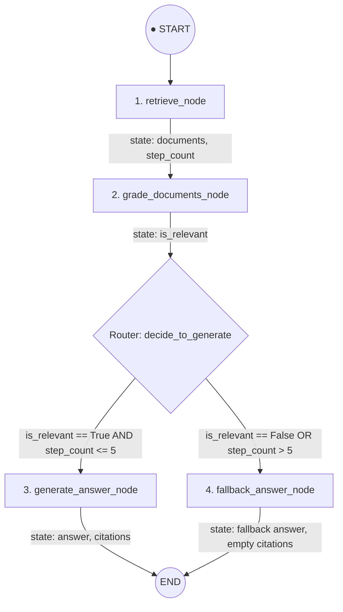

# LangGraph Workflow Architecture

This document details the LangGraph state graph implementation for the Legixo Q&A API (`app/graph.py`).

---

## Graph Diagram



---

## State Definition (`GraphState`)

The graph uses a shared typed state (`TypedDict`) passed sequentially through each node:

```python
class GraphState(TypedDict):
    question: str       # User query
    documents: list      # Retrieved document chunks from Pinecone
    is_relevant: bool    # Boolean relevance grade from Gemini evaluator
    answer: str         # Grounded generated answer or fallback response
    citations: list      # List of source filenames used
    step_count: int      # Guardrail step counter
```

---

## Nodes & Functions

### 1. `retrieve_node`

- **Purpose**: Embeds the user question using `gemini-embedding-001` (3072 dimensions) and queries the Pinecone vector index (`legixo-corpus`) for the **Top 4** most similar chunks.
- **Output State**: Populates `documents` list containing `text`, `filename`, and `score`. Increments `step_count`.

### 2. `grade_documents_node`

- **Purpose**: Acts as a **relevance gatekeeper / hallucination guardrail**. Passes the question and retrieved chunks to `gemini-3.1-flash-lite` using `GRADE_DOCUMENTS_PROMPT_TEMPLATE`.
- **Output State**: Sets `is_relevant` to `True` if Gemini returns `YES`, or `False` if `NO` (or if 0 chunks were retrieved).

### 3. `decide_to_generate` (Router / Conditional Edge)

- **Logic**:
  - **Loop Guardrail**: If `step_count > 5`, routes directly to `fallback_answer_node` to prevent infinite execution loops.
  - **Relevance Check**: If `is_relevant == True`, routes to `generate_answer_node`. Otherwise, routes to `fallback_answer_node`.

### 4. `generate_answer_node`

- **Purpose**: Constructs a grounded, plain-text response using **ONLY** the retrieved document context via `gemini-3.1-flash-lite`.
- **Output State**: Extracts clean answer text and parses explicit `SOURCES USED:` filenames into `citations`.

### 5. `fallback_answer_node`

- **Purpose**: Handles out-of-corpus or irrelevant questions safely.
- **Output State**: Sets `answer` to `"I cannot find relevant information in the provided document set to answer your question."` and `citations` to `[]`.

---

## Guardrails & Safety

1. **Loop Limit**: Max step limit (`step_count > 5`) enforced by router function.
2. **Strict Grounding**: Prompt forbids outside knowledge and markdown formatting.
3. **Traceability**: Compatible with LangSmith tracing via environment variables.
